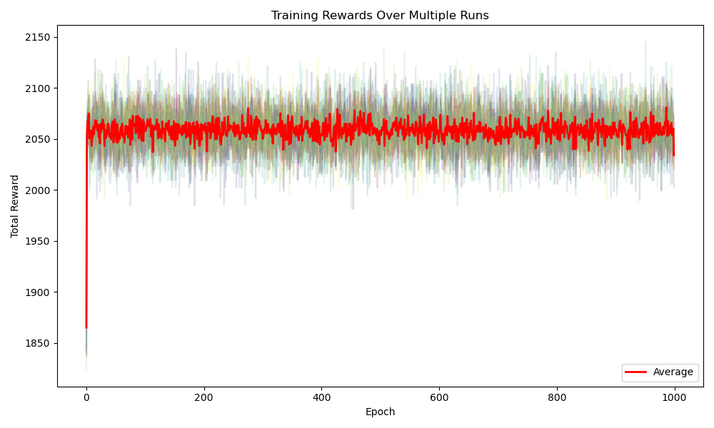
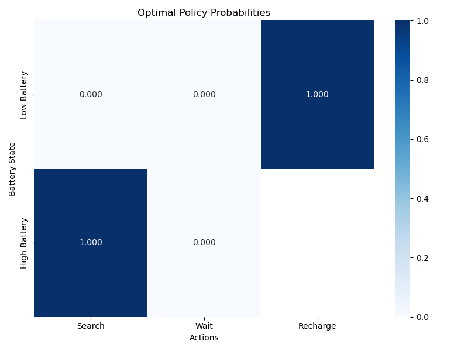
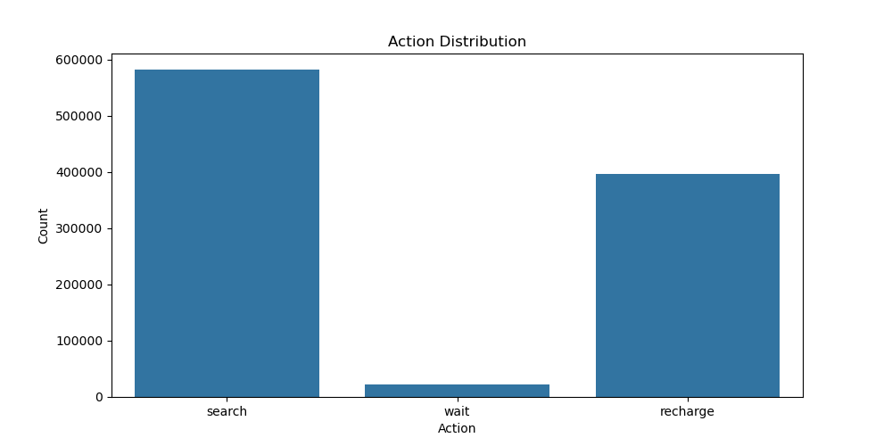

# Grupo

- Henrique Coelho Beltrão
- Henrique Gabriel Gasparelo
- José Thevez Gomes Guedes

# Observação

Utilizamos a extensão do VSCode [Live Share](https://github.com/Microsoft/live-share) durante a escrita dos códigos.

# Relatório 1: Implementar RL para Robô de reciclagem

## Introdução

Neste projeto foi desenvolvido um agente de aprendizado por reforço para controlar a operação de um robô cujo objetivo é a coleta de latas. A implementação segue o enunciado do Exemplo 3.3 do livro Reinforcement Learning: An Introduction (Second Edition), página 53.

O agente foi modelado com dois estados possíveis: bateria alta e bateria baixa. Quando o robô está no estado de bateria baixa, ele pode escolher entre três ações:

- Aguardar, recebendo uma recompensa 𝑟wait.

- Buscar, com probabilidade $1-\beta$ da busca ser bem-sucedida, recebendo uma recompensa 𝑟search, e com uma probabilidade β da bateria se esgotar completamente. Situação em que o robô precisa ser resgatado, retornando ao estado de bateria cheia e recebendo uma penalidade de −3.

- Recarregar, retorna o estado da bateria ao nível alto.

Já no estado de bateria alta, o agente tem a seguintes opções de ações:

- Aguardar, recebendo uma recompensa 𝑟wait.

- Buscar, recebendo uma recompensa 𝑟search, com uma probabilidade α dê o estado da bateria ser atualizado para baixo.

## Decisões tomadas

O problema descrito apresenta características que tornaram necessárias escolhas específicas para o funcionamento correto do algoritmo, as mudanças escolhidas foram as seguintes:

- Apresentação da política: Como o problema possui diferentes estados e cada estado possui uma variedade de ações possíveis para o agente, foi preferido modelar a política como uma matriz, em que as linhas 1 e 2 representam, respectivamente, os valores correspondentes as ações dos estados energia baixa e energia alta, e as colunas 1, 2 e 3 representam, respectivamente, os valores correspondentes as ações "Buscar", "Aguardar" e "Recarregar".

- Atualização da política: Como o problema possui vários pares estado-ação, foi necessário usar o método do máximo q-value para o algoritmo de Diferença Temporal, esse método consiste em atualizar o valor da política de um determinado par estado-ação, usando o valor da recompensa por chegar no próximo no estado, o valor atual desse par na matriz, e o máximo dos valores dos pares estado-ação correspondentes ao próximo estado obtido após a ação, mais precisamente, seja $M$ a matriz descrita no tópico anterior, $i$ o índice do estado antes da ação, $i'$ o índice do estado após a ação, $j$ o índice da ação, $r$ a recompensa obtida e $\gamma$ a taxa de aprendizado, então, a forma que o método atualiza a política é a seguinte:

$$
M_{i j} = M_{i j} + \gamma (r + max{M_{i'} - M_{i j}})
$$

- Atualizações por epoch: Em cada epoch, foi preferido atualizar a política uma única vez no fim da epoch, ao contrário de atualizar a cada passo da epoch.

## Código

O código foi implementado usando pair programming (no caso desse projeto, foi um trabalho simultâneo de 3 pessoas), onde foram escritos os seguintes arquivos:

### main.py

## Resultados
Como resultados, obtive-se o gráfico de recompensas totais por epoch e a política ótima aprendida, ambos plotados usando o arquivo “viz.py”. Segue abaixo o gráfico da média das recompensas por epoch:

  

 

Esse gráfico, como já descrito, contém a média das recompensas totais obtidas em cada epoch, que como pode ser observado, mostra um aprendizado  acentuado nas epochs iniciais e uma estagnação após, o que pode estar refletindo que o agente...
O que também é evidenciado ao analisar a política ótima aprendida, sendo plotada no heatmap a seguir:

  

 

É possível notar que o agente aprendeu a sempre que estiver com bateria alta buscar, e quando a bateria estiver baixa recarregar. Mostrando uma abordagem de menos risco para obter recompensas. Um ponto também interessante é a preferência por não usar a ação de esperar, refletindo a baixa recompensa de esperar, sendo então preferível mesmo no estado de baixa bateria recarregar ao envés de esperar, uma vez que buscando com a bateria alta a recompensa será mais alta e sem risco de receber punições. 

Esta preferencia pode ser observada no gráfico de barras a seguir, que evidencia a quantidade de vezes que cada ação foi tomada:

  

 

O que reafirma o que foi constatado na política apreendida, é observado em sua maioria a ação de “buscar”, seguida pela “recarregar”. Com uma ínfima porção da ação “esperar”, que provavelmente é realizada no início antes do aprendizado da política ótima e também por conta da metodologia exploratória “epsilon-greedy”, que com uma probabilidade ε escolhe uma ação aleatória dentre as disponíveis para estado do agente.
