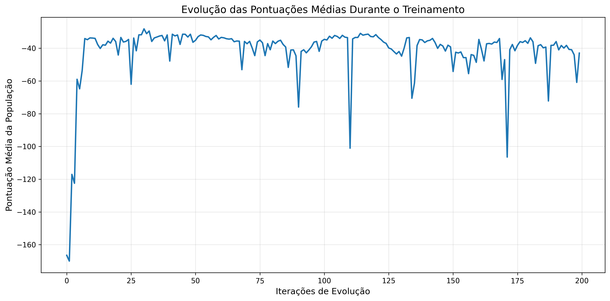

# Ambiente Multi-Agente Speaker-Listener

Este projeto implementa um ambiente de aprendizado por reforço multi-agente baseado no [ambiente Speaker-Listener](https://pettingzoo.farama.org/environments/mpe/simple_speaker_listener), onde dois agentes colaboram para resolver tarefas de comunicação e coordenação.   Os Agentes são treinados usando o Algoritmo MATD3.   
Esta [implementação](https://docs.agilerl.com/en/latest/tutorials/pettingzoo/matd3.html#matd3-tutorial) é fornecida pelo pacote AgileRL, sem garantias de performance.

## Visão Geral

O ambiente Speaker-Listener consiste em dois agentes com papéis distintos:

- **Speaker (Falante)**: Fala mas não pode se mover.
- **Listener (Ouvinte)**: Ouve as mensagens do Speaker e precisa navegar até O alvo.

Um descrição detalhada deste ambiente pode ser encontrada [neste artigo](https://arxiv.org/pdf/1706.02275)
                              
## Características
- Ambiente colaborativo onde os agentes devem aprender a se comunicar eficazmente                     
- Treinamento usando algoritmos de aprendizado por reforço multi-agente
- Suporte para GPU via PyTorch CUDA         
- Implementação modular e extensível 
## Requisitos                               
- Python 3.x                                
- PyTorch                                   
- CUDA (opcional, para aceleração GPU) 
- **uv** (configuração do ambiente e instalação das dependências)
## Como Usar

Após copiar este diretório localmente, inicialize o ambiente virtual definido em pyproject.toml com o comando `uv`:

```bash
uv sync
```

Execute o script principal:                 
```bash                                     
python main.py
```

O sistema detectará automaticamente se CUDA está disponível e utilizará GPU quando possível. 
Ao final do treinamento, é salva a melhor configuração dos agentes treinados, e uma figura com a evolução do score médio dos agentes.

Para gerar a visualização do modelo treinado, execute o script de replay:

```bash
python replay.py
```


## Tarefa

Sua tarefa é implementar um novo algoritmo de aprendizado por reforço multi-agente para o ambiente Speaker-Listener. Este algoritmo deve ser capaz de fazer com que o listener consiga navegar até o alvo mais rápido do que o algoritmo [MATD3 original](https://docs.agilerl.com/en/latest/api/algorithms/matd3.html), ou seja, consiga alcançar um score médio maior que -60(score médio da configuração atual). Alternativamente você pode tentar melhorar a configuração do algoritmo atual de forma a superar  a performance atual.

Para saber mais sobre o algoritmo MATD3, consulte [este artigo](https://arxiv.org/abs/1910.01465).

## Relatório

### Grupo

- Henrique Coelho Beltrão
- Henrique Gabriel Gasparelo
- José Thevez Gomes Guedes

### Introdução

Esse relatório visa apresentar as principais alterações realizadas no modelo de Reinforcement Learning Multi-Agent para o ambiente Speaker-Listener. O objetivo da tarefa foi melhorar o desempenho do algoritmo, obtendo um score médio maior que -60, obtido anteriormente. A seguir, serão apresentadas as principais mudanças e ideias que foram implementadas no modelo a fim de aprimorar seu desempenho.

### Mudanças Realizadas

Com o intuito de melhorar a performance do algoritmo, foram realizadas as seguintes mudanças nos hiperparâmetros iniciais:
- **Alteração em `INIT_HP` (Hiperparâmetros iniciais):**
    - **Alteração dos parâmetros de treinamento da Rede Neural:**:
        - ```"latent_dim"```: $64 \to 128$;
        - ```"encoder_config"```: $[64] \to [256, 128]$;
        - ```"head_config"```: $[64] \to [128, 64]$;

    - **```POPULATION_SIZE```:** $4 \to 5$;
    - **```"BATCH_SIZE"```:** $128 \to 256$;
    - **```"EXPL_NOISE"```:** $0.10 \to 0.15$;
    - **```"LR_ACTOR"```:** $0.0001 \to 0.00005$;
    - **```"GAMMA"```:** $0.95 \to 0.99$;
    - **```"MEMORY_SIZE"```:** $100000 \to 250000$;
    - **```"LEARN_STEP"```:** $100 \to 8$;
    - **```"TAU"```:** $0.01 \to 0.005$;
    - **```"LEARN_STEP"```:** $2 \to 4$;
    - **Inserção do ```"MAX_GRAD_NORM"```: $ \text{N/A} \to 10.0$;**.

- **Alterações em `hp_config` (RL hyperparameters):**
    - ```"lr_actor"```: $[1\times10^{-4},\,1\times10^{-2}] \to [1\times10^{-5},\,5\times10^{-4}]$;
    - ```"lr_critic"```: $[1\times10^{-4},\,1\times10^{-2}] \to [5\times10^{-4},\,3\times10^{-3}]$;
    - ```"batch_size"```: $[8,\,512] \to [128,\,512]$;
    - ```"learn_step"```: $[20,\,200] \to [4,\,32]$;
    - ```"grow_factor"```: $1.5 \to 1.2$;
    - ```"shrink_factor"```: $0.75 \to 0.85$;
    - **Inserção de** ```"tau"```: $[0.003,\,0.01]$;
    - **Inserção de** ```"policy_freq"```: $[3,\,5]$;
    - **Inserção de** ```"gamma"```: $[0.97,\,0.995]$.

- **Alteração em `mutations` (usado para HPO):**
    - ```"no_mutation"```: $0.2 \to 0.50$;
    - ```"architecture"```: $0.2 \to 0.02$;
    - ```"new_layer_prob"```: $0.2 \to 0.01$;
    - ```"parameters"```: $0.2 \to 0.25$;
    - ```"activation"```: $0 \to 0.03$;
    - ```"rl_hp"```: $0.2 \to 0.20$;
    - ```"mutation_sd"```: $0.1 \to 0.06$;
    - ```"rand_seed"```: $1 \to 42$;

- **Alteração nos parâmetros do loop de treino:**
    - ```learning_delay```: $0 \to 1000$;
    - ```eval_loop```: $1 \to 2$;
    - **Inserção do** ```"noise_start"```: `INIT_HP["EXPL_NOISE"]`;
    - **Inserção do** ```"noise_decay"```: $ \text{N/A} \to 400000$;
    - **Inserção do** ```"noise_end"```: $ \text{N/A} \to 0.005$;

Além dessas mudanças, foi implementado um noise decay para diminuir o noise do modelo ao longo das iterações. O modelo começa com um noise inicial de 0.15, que diminui ao longo dos passos até chegar no valor de 0.005. O noise ajuda o modelo a evitar overfitting, mas atrapalha o treinamento depois de muitas iterações, por isso, foi preferido implementar esse ajuste no ruído.

Mesmo com todas essas alterações, foi tentado realizar um treinamento distinto para a rede neural de cada agente, com parâmetros próprios, uma vez que a documentação da biblioteca torna explícito que isso pode ser realizado. Apesar disso, o modelo com essa alteração não apresentou melhorias significantes em relação ao modelo original, evidenciando que a proposta não teve o desempenho esperado. Mesmo assim, a ideia do treinamento personalizado para cada agente pode, com as devidas correções, aprimorar ainda mais o desempenho do modelo, caso seja realizado da forma ideal.

### Resultados Obtidos

Após as alterações dos parâmetros e a implementação do noise decay, o modelo apresentou melhorias significativas em relação ao modelo inicial. Abaixo é possível observar o gráfico do desempenho do modelo atualizado ao longo das iterações.



Pelo gráfico acima, é possível notar um ganho de performance em relação ao algoritmo original. Antes das alterações, o modelo possuia um score médio abaixo de -60, que, após as atualizações, ficou compreendido em um intervalo entre -40 e -30 (com algumas oscilações, mas, em geral, acima de -60, a não ser por dois vales que ocorreram próximo ao início e próximo ao final do treinamento). Portanto, concluí-se que as alterações melhoraram o desempenho do modelo, que apresentou um score mais alto e superou as metas estabelecidas.

